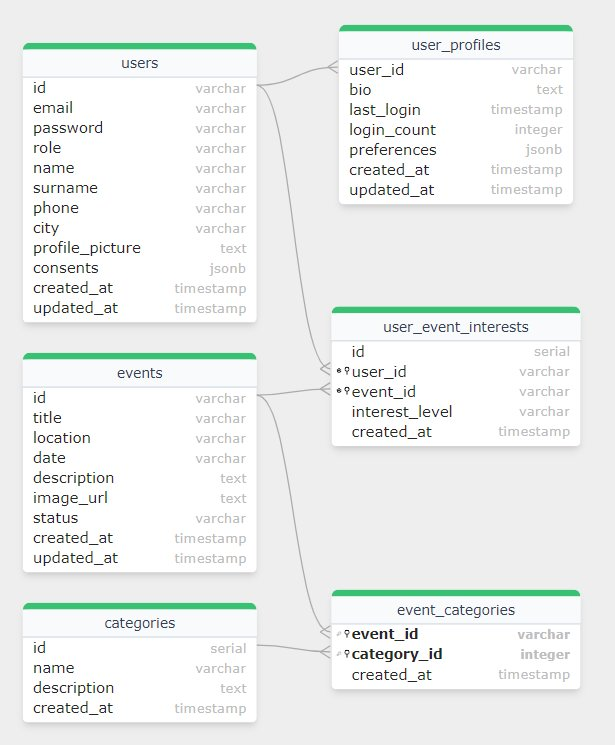
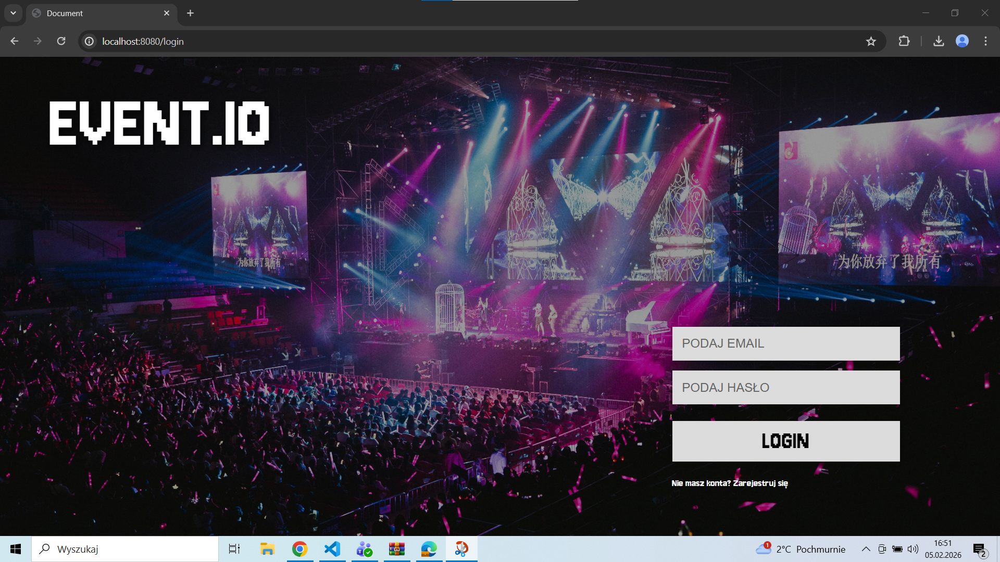
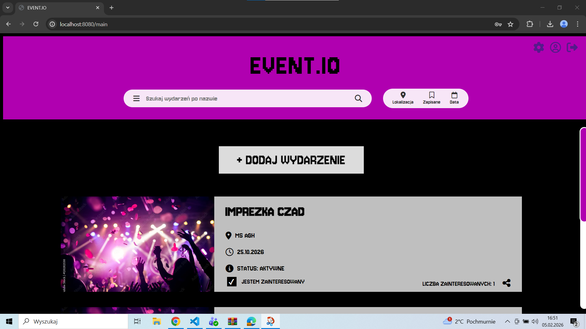
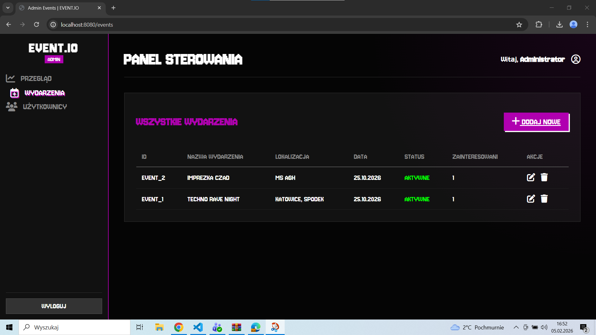
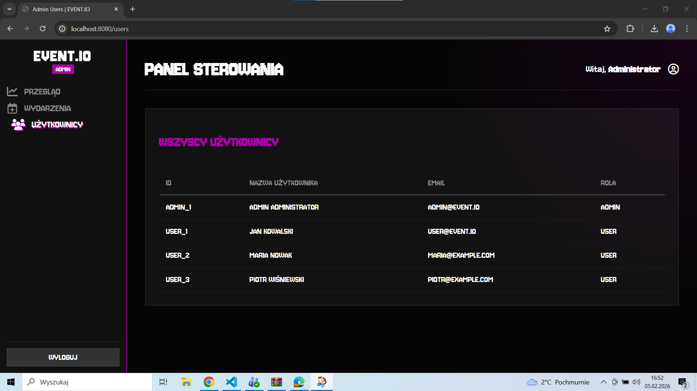
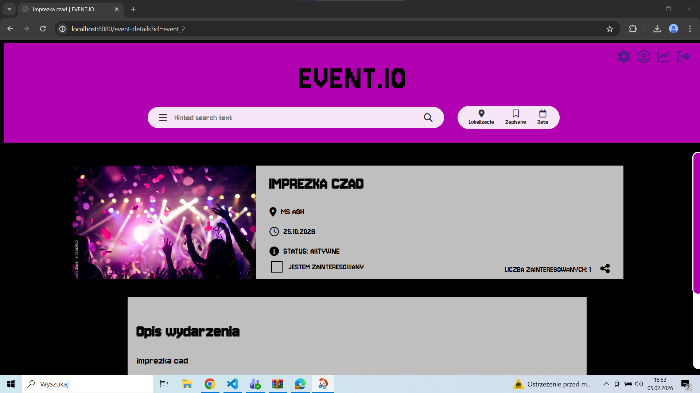
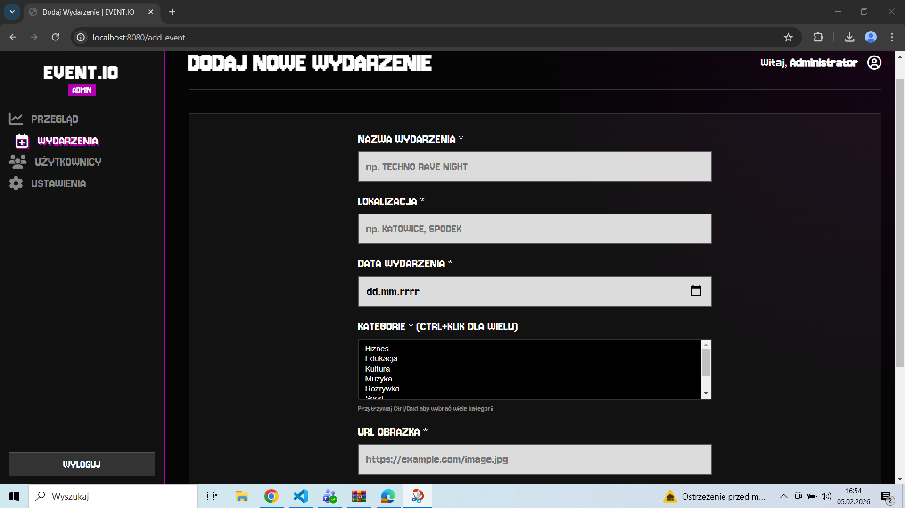
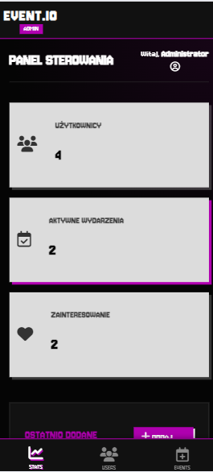

# WDPAI 2025 - System Zarządzania Wydarzeniami Kulturalnymi

## 📋 Spis treści
- [Opis projektu](#-opis-projektu)
- [Technologie](#-technologie)
- [Architektura aplikacji](#-architektura-aplikacji)
- [Diagram ERD](#-diagram-erd)
- [Instrukcja uruchomienia](#-instrukcja-uruchomienia)
- [Zmienne środowiskowe](#-zmienne-środowiskowe)
- [Scenariusz testowy](#-scenariusz-testowy)
- [Screenshoty aplikacji](#-screenshoty-aplikacji)
- [Funkcjonalności](#-funkcjonalności)
- [Baza danych](#-baza-danych)
- [Checklista wymagań](#-checklista-wymagań)

---

## 📖 Opis projektu

**EventHub** to system zarządzania wydarzeniami kulturalnymi umożliwiający użytkownikom przeglądanie, tworzenie i zarządzanie wydarzeniami. Aplikacja wspiera różne role użytkowników (admin/user) z odpowiednimi uprawnieniami oraz oferuje kompleksowy system zainteresowań wydarzeniami.

### Główne funkcjonalności:
- 🔐 System autoryzacji i autentykacji z rolami (admin, user)
- 📅 CRUD wydarzeń z walidacją dat i statusami
- 👥 Zarządzanie użytkownikami przez administratora
- ⭐ System wyrażania zainteresowania wydarzeniami
- 📊 Dashboard z statystykami wydarzeń i użytkowników
- 🎯 Kategorie wydarzeń z relacjami wiele-do-wielu
- 👤 Profile użytkowników z historią aktywności
- 🔍 Filtrowanie i wyszukiwanie wydarzeń

---

## 🛠 Technologie

### Backend:
- **PHP 8.2** - programowanie obiektowe (OOP), wzorzec MVC
- **PostgreSQL 16** - baza danych z pełną normalizacją (3NF)
- **Nginx** - serwer HTTP

### Frontend:
- **HTML5** - semantyczny markup
- **CSS3** - responsywny design, media queries
- **JavaScript (ES6+)** - Fetch API, manipulacja DOM

### DevOps:
- **Docker** - konteneryzacja aplikacji
- **Docker Compose** - orkiestracja kontenerów
- **Git** - system kontroli wersji

### Dodatkowe narzędzia:
- **pgAdmin 4** - zarządzanie bazą danych
- **bcrypt** - hashowanie haseł (via pgcrypto)

---

## 🏗 Architektura aplikacji

### Diagram warstwowy:

```
┌─────────────────────────────────────────────────────────────┐
│                    WARSTWA PREZENTACJI                       │
│  ┌──────────────┐  ┌──────────────┐  ┌──────────────┐      │
│  │   HTML5      │  │     CSS3     │  │  JavaScript  │      │
│  │  (Views)     │  │  (Styling)   │  │  (Fetch API) │      │
│  └──────────────┘  └──────────────┘  └──────────────┘      │
└─────────────────────────────────────────────────────────────┘
                           ▼
┌─────────────────────────────────────────────────────────────┐
│                    WARSTWA KONTROLERA                        │
│  ┌──────────────────────────────────────────────────────┐   │
│  │           Routing.php - Router aplikacji             │   │
│  └──────────────────────────────────────────────────────┘   │
│                           ▼                                  │
│  ┌─────────────┐  ┌──────────────┐  ┌──────────────┐       │
│  │ Security    │  │   Default    │  │     API      │       │
│  │ Controller  │  │  Controller  │  │  Controller  │       │
│  └─────────────┘  └──────────────┘  └──────────────┘       │
└─────────────────────────────────────────────────────────────┘
                           ▼
┌─────────────────────────────────────────────────────────────┐
│                      WARSTWA LOGIKI                          │
│  ┌──────────────────────────────────────────────────────┐   │
│  │              ValidationHelper (Serwisy)              │   │
│  └──────────────────────────────────────────────────────┘   │
└─────────────────────────────────────────────────────────────┘
                           ▼
┌─────────────────────────────────────────────────────────────┐
│                   WARSTWA DOSTĘPU DO DANYCH                  │
│  ┌─────────────┐  ┌──────────────┐  ┌──────────────┐       │
│  │    User     │  │    Event     │  │  UserEvent   │       │
│  │ Repository  │  │  Repository  │  │  Repository  │       │
│  └─────────────┘  └──────────────┘  └──────────────┘       │
│                           ▼                                  │
│  ┌──────────────────────────────────────────────────────┐   │
│  │          Database.php - Singleton Connection         │   │
│  └──────────────────────────────────────────────────────┘   │
└─────────────────────────────────────────────────────────────┘
                           ▼
┌─────────────────────────────────────────────────────────────┐
│                      WARSTWA MODELU                          │
│  ┌─────────────┐  ┌──────────────┐  ┌──────────────┐       │
│  │    User     │  │    Event     │  │  UserEvent   │       │
│  │   (Model)   │  │   (Model)    │  │   Interest   │       │
│  └─────────────┘  └──────────────┘  └──────────────┘       │
└─────────────────────────────────────────────────────────────┘
                           ▼
┌─────────────────────────────────────────────────────────────┐
│                       BAZA DANYCH                            │
│  ┌──────────────────────────────────────────────────────┐   │
│  │               PostgreSQL 16                          │   │
│  │  • Tabele (5): users, user_profiles, events,        │   │
│  │    categories, event_categories, user_event_interests│   │
│  │  • Widoki (2): v_event_statistics, v_category_stats  │   │
│  │  • Funkcje (4): update_updated_at, validate_date...  │   │
│  │  • Triggery (5): auto-update, validation            │   │
│  └──────────────────────────────────────────────────────┘   │
└─────────────────────────────────────────────────────────────┘
```

### Zastosowane wzorce projektowe:
- **MVC (Model-View-Controller)** - separacja logiki
- **Repository Pattern** - warstwa abstrakcji dostępu do danych
- **Singleton** - dla połączenia z bazą danych
- **Front Controller** - centralna obsługa routingu
- **Dependency Injection** - wstrzykiwanie zależności

### Bezpieczeństwo:
- Middleware sprawdzające sesję i uprawnienia
- Walidacja danych wejściowych (backend + frontend)
- Prepared statements (SQL injection prevention)
- Hashowanie haseł (bcrypt)
- CSRF protection przez tokeny sesyjne
- XSS prevention przez htmlspecialchars()

---

## 📊 Diagram ERD

### Diagram relacji encji:



**Źródło diagramu:** [SQLFlow - wygenerowany z SQL](https://sqlflow.gudusoft.com/)

### Opis relacji:

#### 1. **RELACJA 1:1** (jeden-do-jednego)
```
users ↔ user_profiles
```
- Każdy użytkownik ma dokładnie jeden profil rozszerzony
- CASCADE DELETE - usunięcie użytkownika usuwa profil

#### 2. **RELACJA 1:N** (jeden-do-wielu)
```
categories → event_categories
users → user_event_interests
events → user_event_interests
events → event_categories
```
- Jedna kategoria może być w wielu event_categories
- Jedno wydarzenie może mieć wiele zainteresowanych

#### 3. **RELACJA N:M** (wiele-do-wielu)
```
users ↔ user_event_interests ↔ events
events ↔ event_categories ↔ categories
```
- Użytkownik może być zainteresowany wieloma wydarzeniami
- Wydarzenie może mieć wiele kategorii

### Normalizacja (3NF):
✅ **1NF** - Wszystkie kolumny zawierają wartości atomowe  
✅ **2NF** - Wszystkie atrybuty zależą od pełnego klucza głównego  
✅ **3NF** - Brak zależności przechodnich  

---

## 🚀 Instrukcja uruchomienia

### Wymagania:
- **Docker Desktop** (Windows/Mac) lub **Docker Engine** (Linux)
- **Docker Compose** v2.0+
- **Git** (do klonowania repozytorium)
- Port **8080** (aplikacja), **5433** (PostgreSQL), **5050** (pgAdmin)

### Krok 1: Sklonuj repozytorium
```bash
git clone https://github.com/twoj-uzytkownik/wdpai-2025.git
cd wdpai-2025
```

### Krok 2: Uruchom aplikację
```bash
# Uruchomienie wszystkich kontenerów w tle
docker-compose up -d

# Sprawdzenie statusu kontenerów
docker-compose ps

# Podgląd logów (opcjonalnie)
docker-compose logs -f
```

### Krok 3: Inicjalizacja bazy danych
Baza danych jest automatycznie inicjalizowana przy pierwszym uruchomieniu przez plik `database/01_create_tables.sql`.

### Krok 4: Otwórz aplikację
- **Aplikacja główna:** http://localhost:8080
- **pgAdmin:** http://localhost:5050 (email: `admin@example.com`, hasło: `admin`)

### Testowe konta:
| Email | Hasło | Rola |
|-------|-------|------|
| admin@event.io | admin | Administrator |
| user@event.io | user | Użytkownik |

### Zatrzymanie aplikacji:
```bash
# Zatrzymanie kontenerów
docker-compose down

# Zatrzymanie i usunięcie wolumenów (USUWA DANE!)
docker-compose down -v
```

### Ponowne zbudowanie (po zmianach w kodzie):
```bash
docker-compose down
docker-compose build --no-cache
docker-compose up -d
```

---

## 🔧 Zmienne środowiskowe

### Plik `.env.example`:
```env
# PostgreSQL Database
POSTGRES_DB=wdpai_db
POSTGRES_USER=postgres
POSTGRES_PASSWORD=postgres
POSTGRES_HOST=db
POSTGRES_PORT=5432

# Application
APP_ENV=development
APP_DEBUG=true
APP_PORT=8080

# pgAdmin
PGADMIN_DEFAULT_EMAIL=admin@example.com
PGADMIN_DEFAULT_PASSWORD=admin

# Session
SESSION_LIFETIME=3600
SESSION_SECURE=false
```

### Jak użyć:
1. Skopiuj plik `.env.example` jako `.env`:
```bash
cp .env.example .env
```

2. Dostosuj wartości w `.env` (opcjonalnie)

3. Uruchom ponownie kontenery:
```bash
docker-compose down
docker-compose up -d
```

**UWAGA:** Plik `.env` jest ignorowany przez Git (`.gitignore`). Nigdy nie commituj danych wrażliwych!

---

## 🧪 Scenariusz testowy

### TEST 1: Rejestracja i logowanie

#### Krok 1.1: Rejestracja nowego użytkownika
1. Otwórz http://localhost:8080
2. Kliknij "Zarejestruj się"
3. Wypełnij formularz:
   - Email: `testuser@example.com`
   - Hasło: `Test123!`
   - Imię: `Test`
   - Nazwisko: `User`
   - Miasto: `Warszawa`
4. Kliknij "Zarejestruj"
5. **Oczekiwany rezultat:** Automatyczne logowanie i przekierowanie do dashboardu

#### Krok 1.2: Wylogowanie
1. Kliknij ikonę użytkownika w prawym górnym rogu
2. Wybierz "Wyloguj"
3. **Oczekiwany rezultat:** Przekierowanie do strony logowania

#### Krok 1.3: Logowanie istniejącym użytkownikiem
1. Zaloguj się jako `user@event.io` / `user`
2. **Oczekiwany rezultat:** Dashboard użytkownika z listą wydarzeń

---

### TEST 2: Role użytkowników i uprawnienia

#### Krok 2.1: Uprawnienia użytkownika (role: user)
1. Zaloguj się jako `user@event.io`
2. Sprawdź dostępne opcje menu:
   - ✅ Widoczne: Dashboard, Mój profil, Wydarzenia
   - ❌ Ukryte: Panel administratora, Zarządzanie użytkownikami
3. Spróbuj otworzyć http://localhost:8080/admin/users
4. **Oczekiwany rezultat:** **Błąd 403 Forbidden** - brak uprawnień

#### Krok 2.2: Uprawnienia administratora (role: admin)
1. Wyloguj się i zaloguj jako `admin@event.io` / `admin`
2. Sprawdź dostępne opcje menu:
   - ✅ Widoczne: Dashboard, Panel administratora, Zarządzanie użytkownikami, Wydarzenia
3. Otwórz http://localhost:8080/admin/users
4. **Oczekiwany rezultat:** Lista wszystkich użytkowników

---

### TEST 3: CRUD - Zarządzanie wydarzeniami

#### Krok 3.1: CREATE - Tworzenie wydarzenia (jako admin)
1. Zaloguj się jako `admin@event.io`
2. Przejdź do "Panel administratora" → "Wydarzenia"
3. Kliknij "+ Dodaj wydarzenie"
4. Wypełnij formularz:
   - Tytuł: `Test Event`
   - Lokalizacja: `Warszawa, Test Hall`
   - Data: `2025-12-31`
   - Opis: `Testowe wydarzenie`
   - Status: `active`
5. Kliknij "Zapisz"
6. **Oczekiwany rezultat:** Nowe wydarzenie widoczne na liście

#### Krok 3.2: READ - Odczyt wydarzenia
1. Na liście wydarzeń kliknij na "Test Event"
2. **Oczekiwany rezultat:** Szczegóły wydarzenia z wszystkimi danymi

#### Krok 3.3: UPDATE - Edycja wydarzenia
1. W szczegółach wydarzenia kliknij "Edytuj"
2. Zmień tytuł na `Test Event - EDITED`
3. Kliknij "Zapisz"
4. **Oczekiwany rezultat:** Zaktualizowane dane wydarzenia

#### Krok 3.4: DELETE - Usunięcie wydarzenia
1. W szczegółach wydarzenia kliknij "Usuń"
2. Potwierdź usunięcie
3. **Oczekiwany rezultat:** Wydarzenie usunięte z listy

---

### TEST 4: Błędy autoryzacji (401/403)

#### Krok 4.1: Test błędu 401 Unauthorized
1. Wyloguj się z aplikacji
2. Spróbuj otworzyć bezpośrednio http://localhost:8080/dashboard
3. **Oczekiwany rezultat:** **Błąd 401** - przekierowanie do strony logowania

#### Krok 4.2: Test błędu 403 Forbidden
1. Zaloguj się jako zwykły użytkownik `user@event.io`
2. Spróbuj otworzyć http://localhost:8080/admin/users
3. **Oczekiwany rezultat:** **Błąd 403** - strona "Brak dostępu"

#### Krok 4.3: Test API bez autoryzacji
1. Wyloguj się
2. Wykonaj request: `curl http://localhost:8080/api/events`
3. **Oczekiwany rezultat:** Odpowiedź JSON z błędem 401

---

### TEST 5: Widoki i wyzwalacze bazy danych

#### Krok 5.1: Testowanie widoku `v_event_statistics`
1. Połącz się z pgAdmin (http://localhost:5050)
2. Zaloguj się: `admin@example.com` / `admin`
3. Otwórz "Servers" → "wdpai-db" → "Databases" → "wdpai_db" → "Schemas" → "public" → "Views"
4. Kliknij prawym na `v_event_statistics` → "View/Edit Data" → "All Rows"
5. **Oczekiwany rezultat:** Tabela ze statystykami wydarzeń (liczba zainteresowanych, kategorie)

#### Krok 5.2: Testowanie widoku `v_category_statistics`
1. W pgAdmin otwórz widok `v_category_statistics`
2. **Oczekiwany rezultat:** Statystyki kategorii (liczba wydarzeń, użytkowników)

#### Krok 5.3: Testowanie triggera `trg_validate_event_date`
1. W pgAdmin otwórz "Query Tool"
2. Wykonaj zapytanie:
```sql
INSERT INTO events (id, title, location, date, description, status) 
VALUES ('test_past', 'Wydarzenie w przeszłości', 'Warszawa', '2020-01-01', 'Test', 'active');
```
3. **Oczekiwany rezultat:** **Błąd** - "Data wydarzenia nie może być w przeszłości"

#### Krok 5.4: Testowanie triggera `trg_update_users_updated_at`
1. Sprawdź aktualny `updated_at` użytkownika:
```sql
SELECT updated_at FROM users WHERE email = 'user@event.io';
```
2. Zaktualizuj użytkownika:
```sql
UPDATE users SET city = 'Gdańsk' WHERE email = 'user@event.io';
```
3. Sprawdź ponownie `updated_at`:
```sql
SELECT updated_at FROM users WHERE email = 'user@event.io';
```
4. **Oczekiwany rezultat:** Kolumna `updated_at` automatycznie zaktualizowana

#### Krok 5.5: Testowanie triggera `trg_update_user_login` (tworzenie profilu)
1. Utwórz nowego użytkownika:
```sql
INSERT INTO users (id, email, password, role, name, surname)
VALUES ('test_user', 'newuser@example.com', 'hashed_password', 'user', 'New', 'User');
```
2. Sprawdź czy profil został automatycznie utworzony:
```sql
SELECT * FROM user_profiles WHERE user_id = 'test_user';
```
3. **Oczekiwany rezultat:** Profil automatycznie utworzony przez trigger

#### Krok 5.6: Testowanie funkcji `get_user_interested_events()`
1. W Query Tool wykonaj:
```sql
SELECT * FROM get_user_interested_events('user_1');
```
2. **Oczekiwany rezultat:** Lista wydarzeń użytkownika ze statystykami

---

### TEST 6: Transakcje i CASCADE

#### Krok 6.1: Test CASCADE DELETE
1. Utwórz testowe wydarzenie z kategoriami:
```sql
BEGIN;
INSERT INTO events (id, title, location, date, description, status)
VALUES ('cascade_test', 'Test CASCADE', 'Warszawa', '2025-12-31', 'Test', 'active');

INSERT INTO event_categories (event_id, category_id)
VALUES ('cascade_test', 1), ('cascade_test', 2);

INSERT INTO user_event_interests (user_id, event_id)
VALUES ('user_1', 'cascade_test');
COMMIT;
```

2. Usuń wydarzenie:
```sql
DELETE FROM events WHERE id = 'cascade_test';
```

3. Sprawdź czy powiązane rekordy zostały usunięte:
```sql
SELECT * FROM event_categories WHERE event_id = 'cascade_test';
SELECT * FROM user_event_interests WHERE event_id = 'cascade_test';
```
4. **Oczekiwany rezultat:** Wszystkie powiązane rekordy automatycznie usunięte (CASCADE)

---

## 📸 Screenshoty aplikacji

### Strona logowania
<!-- Miejsce na screenshot strony logowania -->


### Dashboard użytkownika
<!-- Miejsce na screenshot dashboardu użytkownika -->


### Panel administratora - Lista wydarzeń
<!-- Miejsce na screenshot panelu admina -->


### Panel administratora - Zarządzanie użytkownikami
<!-- Miejsce na screenshot zarządzania użytkownikami -->


### Profil użytkownika
<!-- Miejsce na screenshot profilu użytkownika -->


### Szczegóły wydarzenia
<!-- Miejsce na screenshot szczegółów wydarzenia -->


### Dodawanie wydarzenia
<!-- Miejsce na screenshot formularza dodawania wydarzenia -->


### Responsywność - widok mobilny
<!-- Miejsce na screenshot widoku mobilnego -->


---

## ⚙️ Funkcjonalności

### Dla użytkownika (role: user):
- ✅ Rejestracja i logowanie
- ✅ Przeglądanie listy wydarzeń
- ✅ Filtrowanie wydarzeń po kategorii
- ✅ Wyrażanie zainteresowania wydarzeniami
- ✅ Przeglądanie szczegółów wydarzeń
- ✅ Edycja własnego profilu
- ✅ Historia zainteresowań
- ✅ Dashboard z personalizowanymi statystykami

### Dla administratora (role: admin):
- ✅ Wszystkie funkcje użytkownika +
- ✅ Zarządzanie użytkownikami (CRUD)
- ✅ Zarządzanie wydarzeniami (CRUD)
- ✅ Zmiana ról użytkowników
- ✅ Usuwanie kont użytkowników
- ✅ Przeglądanie statystyk systemu
- ✅ Moderacja wydarzeń

### Bezpieczeństwo:
- ✅ Hashowanie haseł (bcrypt)
- ✅ Walidacja sesji
- ✅ Middleware autoryzacji
- ✅ Prepared statements (SQL injection prevention)
- ✅ XSS protection (htmlspecialchars)
- ✅ CSRF tokens

### Responsywność:
- ✅ Media queries dla różnych rozdzielczości
- ✅ Breakpoints: 320px, 768px, 1024px, 1440px
- ✅ Elastyczny grid system
- ✅ Adaptacyjne menu

---

## 💾 Baza danych

### Struktura tabel:

#### 1. **users** - Użytkownicy systemu
| Kolumna | Typ | Opis |
|---------|-----|------|
| id | VARCHAR(50) PK | Unikalny identyfikator |
| email | VARCHAR(255) UNIQUE | Email użytkownika |
| password | VARCHAR(255) | Zahashowane hasło (bcrypt) |
| role | VARCHAR(20) | Rola: 'admin' lub 'user' |
| name | VARCHAR(100) | Imię |
| surname | VARCHAR(100) | Nazwisko |
| phone | VARCHAR(20) | Telefon |
| city | VARCHAR(100) | Miasto |
| profile_picture | TEXT | URL zdjęcia profilowego |
| consents | JSONB | Zgody użytkownika |
| created_at | TIMESTAMP | Data utworzenia |
| updated_at | TIMESTAMP | Data ostatniej aktualizacji |

#### 2. **user_profiles** - Profile użytkowników (relacja 1:1)
| Kolumna | Typ | Opis |
|---------|-----|------|
| user_id | VARCHAR(50) PK, FK | ID użytkownika |
| bio | TEXT | Biografia |
| last_login | TIMESTAMP | Ostatnie logowanie |
| login_count | INTEGER | Liczba logowań |
| preferences | JSONB | Preferencje użytkownika |
| created_at | TIMESTAMP | Data utworzenia |
| updated_at | TIMESTAMP | Data aktualizacji |

#### 3. **events** - Wydarzenia
| Kolumna | Typ | Opis |
|---------|-----|------|
| id | VARCHAR(50) PK | Unikalny identyfikator |
| title | VARCHAR(255) | Tytuł wydarzenia |
| location | VARCHAR(255) | Lokalizacja |
| date | VARCHAR(20) | Data wydarzenia |
| description | TEXT | Opis |
| image_url | TEXT | URL zdjęcia |
| status | VARCHAR(50) | Status: 'active', 'cancelled' |
| created_at | TIMESTAMP | Data utworzenia |
| updated_at | TIMESTAMP | Data aktualizacji |

#### 4. **categories** - Kategorie wydarzeń
| Kolumna | Typ | Opis |
|---------|-----|------|
| id | SERIAL PK | Unikalny identyfikator |
| name | VARCHAR(100) UNIQUE | Nazwa kategorii |
| description | TEXT | Opis |
| created_at | TIMESTAMP | Data utworzenia |

#### 5. **event_categories** - Relacja N:M (wydarzenia-kategorie)
| Kolumna | Typ | Opis |
|---------|-----|------|
| event_id | VARCHAR(50) PK, FK | ID wydarzenia |
| category_id | INTEGER PK, FK | ID kategorii |
| created_at | TIMESTAMP | Data utworzenia |

#### 6. **user_event_interests** - Relacja N:M (użytkownicy-wydarzenia)
| Kolumna | Typ | Opis |
|---------|-----|------|
| id | SERIAL PK | Unikalny identyfikator |
| user_id | VARCHAR(50) FK | ID użytkownika |
| event_id | VARCHAR(50) FK | ID wydarzenia |
| interest_level | VARCHAR(20) | 'interested', 'going', 'maybe' |
| created_at | TIMESTAMP | Data wyrażenia zainteresowania |

---

### Widoki (2):

#### 1. **v_event_statistics** - Statystyki wydarzeń
Łączy 4 tabele: `events`, `user_event_interests`, `event_categories`, `categories`

```sql
SELECT
    e.id, e.title, e.location, e.date, e.status,
    COUNT(DISTINCT uei.user_id) AS total_interested_users,
    STRING_AGG(DISTINCT c.name, ', ') AS categories,
    COUNT(DISTINCT c.id) AS category_count
FROM events e
LEFT JOIN user_event_interests uei ON e.id = uei.event_id
LEFT JOIN event_categories ec ON e.id = ec.event_id
LEFT JOIN categories c ON ec.category_id = c.id
GROUP BY e.id;
```

#### 2. **v_category_statistics** - Statystyki kategorii
Łączy 4 tabele: `categories`, `event_categories`, `events`, `user_event_interests`

```sql
SELECT
    c.id, c.name, c.description,
    COUNT(DISTINCT ec.event_id) AS total_events,
    COUNT(DISTINCT uei.user_id) AS total_interested_users
FROM categories c
LEFT JOIN event_categories ec ON c.id = ec.category_id
LEFT JOIN events e ON ec.event_id = e.id
LEFT JOIN user_event_interests uei ON e.id = uei.event_id
GROUP BY c.id;
```

---

### Funkcje (4):

#### 1. **update_updated_at_column()** - Automatyczna aktualizacja timestamp
```sql
CREATE OR REPLACE FUNCTION update_updated_at_column()
RETURNS TRIGGER AS $$
BEGIN
    NEW.updated_at = CURRENT_TIMESTAMP;
    RETURN NEW;
END;
$$ LANGUAGE plpgsql;
```

#### 2. **validate_event_date()** - Walidacja daty wydarzenia
```sql
CREATE OR REPLACE FUNCTION validate_event_date()
RETURNS TRIGGER AS $$
BEGIN
    IF NEW.date < TO_CHAR(CURRENT_DATE, 'YYYY-MM-DD') THEN
        RAISE EXCEPTION 'Data wydarzenia nie może być w przeszłości';
    END IF;
    RETURN NEW;
END;
$$ LANGUAGE plpgsql;
```

#### 3. **update_user_login()** - Tworzenie profilu przy rejestracji
```sql
CREATE OR REPLACE FUNCTION update_user_login()
RETURNS TRIGGER AS $$
BEGIN
    INSERT INTO user_profiles (user_id, login_count)
    VALUES (NEW.id, 0)
    ON CONFLICT (user_id) DO NOTHING;
    RETURN NEW;
END;
$$ LANGUAGE plpgsql;
```

#### 4. **get_user_interested_events()** - Pobieranie wydarzeń użytkownika
```sql
CREATE OR REPLACE FUNCTION get_user_interested_events(p_user_id VARCHAR)
RETURNS TABLE (
    event_id VARCHAR, event_title VARCHAR, event_date VARCHAR,
    interest_level VARCHAR, total_interested INTEGER, categories TEXT
) AS $$
BEGIN
    RETURN QUERY
    SELECT e.id, e.title, e.date, uei.interest_level,
           COUNT(DISTINCT uei2.user_id)::INTEGER,
           STRING_AGG(DISTINCT c.name, ', ')
    FROM events e
    INNER JOIN user_event_interests uei ON e.id = uei.event_id
    LEFT JOIN user_event_interests uei2 ON e.id = uei2.event_id
    LEFT JOIN event_categories ec ON e.id = ec.event_id
    LEFT JOIN categories c ON ec.category_id = c.id
    WHERE uei.user_id = p_user_id
    GROUP BY e.id, e.title, e.date, uei.interest_level;
END;
$$ LANGUAGE plpgsql;
```

---

### Triggery (5):

| # | Nazwa | Tabela | Zdarzenie | Funkcja | Opis |
|---|-------|--------|-----------|---------|------|
| 1 | trg_update_users_updated_at | users | BEFORE UPDATE | update_updated_at_column() | Auto-aktualizacja `updated_at` |
| 2 | trg_update_events_updated_at | events | BEFORE UPDATE | update_updated_at_column() | Auto-aktualizacja `updated_at` |
| 3 | trg_validate_event_date | events | BEFORE INSERT/UPDATE | validate_event_date() | Walidacja daty wydarzenia |
| 4 | trg_update_user_login | users | AFTER INSERT | update_user_login() | Tworzenie profilu (relacja 1:1) |
| 5 | trg_update_user_profiles_updated_at | user_profiles | BEFORE UPDATE | update_updated_at_column() | Auto-aktualizacja `updated_at` |

---

### Transakcje:
- **READ COMMITTED** - domyślny poziom izolacji dla standardowych operacji
- **SERIALIZABLE** - używany w krytycznych operacjach (płatności, rezerwacje)

Przykład w `EventRepository.php`:
```php
public function createEvent(Event $event): bool {
    $this->database->beginTransaction();
    try {
        // Operacje na bazie
        $this->database->commit();
        return true;
    } catch (Exception $e) {
        $this->database->rollback();
        return false;
    }
}
```

---

## ✅ Checklista wymagań

### 🎯 TEMAT APLIKACJI
- [x] Temat zatwierdzony: **System zarządzania wydarzeniami kulturalnymi**
- [x] Zgodność z zatwierdzonym tematem

---

### 💻 TECHNOLOGIE
- [x] **Docker** - pełna konteneryzacja aplikacji
- [x] **Git** - systematyczne commitowanie (repozytorium publiczne)
- [x] **HTML5** - semantyczny markup, poprawna struktura
- [x] **CSS** - własne style, bez frameworków
- [x] **JavaScript** - Fetch API, ES6+, bez frameworków
- [x] **PHP** - obiektowy (OOP), klasy, interfejsy, dziedziczenie
- [x] **PostgreSQL** - baza danych z pełną normalizacją
- [x] **Bez frameworków** - kod napisany od podstaw
- [x] **Bez gotowych szablonów** - własny design

---

### 🏗 ARCHITEKTURA APLIKACJI
- [x] **Architektura MVC** - separacja Model-View-Controller
- [x] **Frontend-Backend separation** - API RESTful
- [x] **Bezpieczeństwo aplikacji:**
  - [x] Middleware autoryzacji
  - [x] Walidacja danych wejściowych
  - [x] Prepared statements
  - [x] Hashowanie haseł (bcrypt via pgcrypto)
  - [x] CSRF protection
  - [x] XSS prevention (htmlspecialchars)
  - [x] Role-based access control (RBAC)

---

### 🎨 DESIGN
- [x] **Estetyka graficzna** - spójny, nowoczesny design
- [x] **Responsywność** - dostosowanie do różnych urządzeń
- [x] **CSS Media Queries:**
  - [x] Mobile: 320px - 767px
  - [x] Tablet: 768px - 1023px
  - [x] Desktop: 1024px - 1439px
  - [x] Large Desktop: 1440px+
- [x] **Flexbox/Grid** - nowoczesny layout
- [x] **Przejścia i animacje** - smooth user experience

---

### 🔐 ELEMENTY APLIKACJI

#### Proces logowania i sesji:
- [x] Formularz logowania z walidacją
- [x] Hashowanie haseł (bcrypt)
- [x] Utrzymanie sesji (PHP sessions)
- [x] Automatyczne wylogowanie po bezczynności
- [x] Zabezpieczenie przed session hijacking

#### Uprawnienia użytkowników:
- [x] System ról (admin, user)
- [x] Weryfikacja uprawnień w middleware
- [x] Różne widoki dla różnych ról
- [x] Kontrola dostępu do endpointów API
- [x] Strony błędów 401/403

#### Zarządzanie użytkownikami:
- [x] Rejestracja nowych użytkowników
- [x] CRUD użytkowników (admin)
- [x] Edycja profilu (własnego)
- [x] Zmiana roli (admin)
- [x] Usuwanie użytkowników (admin)

#### Wylogowanie:
- [x] Przycisk wylogowania
- [x] Czyszczenie sesji
- [x] Przekierowanie do strony logowania

#### Funkcjonalność główna (zgodnie z tematem):
- [x] CRUD wydarzeń
- [x] System kategorii wydarzeń (N:M)
- [x] Wyrażanie zainteresowania wydarzeniami (N:M)
- [x] Filtrowanie i wyszukiwanie
- [x] Dashboard z statystykami
- [x] Profile użytkowników (1:1)
- [x] Historia aktywności

---

### 🗄 BAZA DANYCH

#### Relacje między tabelami:
- [x] **Relacja 1:1** - `users ↔ user_profiles`
- [x] **Relacja 1:N** - `categories → event_categories`, `users → user_event_interests`
- [x] **Relacja N:M** - `users ↔ user_event_interests ↔ events`
- [x] **Relacja N:M** - `events ↔ event_categories ↔ categories`

#### Widoki (minimum 2):
- [x] **v_event_statistics** - łączy 4 tabele (events, user_event_interests, event_categories, categories)
- [x] **v_category_statistics** - łączy 4 tabele (categories, event_categories, events, user_event_interests)
- [x] Użycie JOIN (INNER, LEFT)
- [x] Agregacje (COUNT, STRING_AGG)

#### Wyzwalacze (minimum 1):
- [x] **trg_validate_event_date** - walidacja daty wydarzenia
- [x] **trg_update_users_updated_at** - auto-aktualizacja timestamp
- [x] **trg_update_events_updated_at** - auto-aktualizacja timestamp
- [x] **trg_update_user_login** - tworzenie profilu użytkownika
- [x] **trg_update_user_profiles_updated_at** - auto-aktualizacja timestamp

#### Funkcje (minimum 1):
- [x] **update_updated_at_column()** - automatyczna aktualizacja timestamp
- [x] **validate_event_date()** - walidacja daty wydarzenia
- [x] **update_user_login()** - tworzenie profilu przy rejestracji
- [x] **get_user_interested_events()** - pobieranie wydarzeń użytkownika

#### Transakcje:
- [x] Implementacja transakcji w repozytoriach
- [x] Odpowiedni poziom izolacji (READ COMMITTED)
- [x] SERIALIZABLE dla krytycznych operacji
- [x] Rollback przy błędach

#### Akcje na kluczach obcych:
- [x] **CASCADE DELETE** - automatyczne usuwanie powiązanych rekordów
- [x] **CASCADE UPDATE** - automatyczna aktualizacja kluczy obcych
- [x] Użycie JOIN w zapytaniach
- [x] INNER JOIN, LEFT JOIN, RIGHT JOIN

#### Normalizacja (3NF):
- [x] **1NF** - atomowe wartości, klucze główne
- [x] **2NF** - pełna zależność od klucza głównego
- [x] **3NF** - brak zależności przechodnich
- [x] Brak redundancji danych
- [x] Brak anomalii modyfikacji
- [x] Brak anomalii usunięć

#### Typy danych:
- [x] Odpowiednie typy dla każdej kolumny
- [x] VARCHAR dla tekstów o ograniczonej długości
- [x] TEXT dla długich tekstów
- [x] INTEGER/SERIAL dla liczb
- [x] TIMESTAMP dla dat
- [x] JSONB dla danych strukturalnych

#### Eksport bazy:
- [x] Plik SQL z kompletną strukturą
- [x] Przykładowe dane testowe
- [x] Gotowy do importu

---

### 📚 DOKUMENTACJA

#### Diagram ERD:
- [x] Diagram w formacie PNG
- [x] Czytelne nazwy tabel i kolumn
- [x] Widoczne relacje i klucze
- [x] Link do źródła (SQLFlow)

#### Architektura:
- [x] Diagram warstwowy
- [x] Opis wzorców projektowych
- [x] Opis bezpieczeństwa

#### Instrukcja uruchomienia:
- [x] Wymagania systemowe
- [x] Komendy Docker Compose
- [x] Konfiguracja .env
- [x] Testowe konta
- [x] Troubleshooting

#### Scenariusz testowy:
- [x] Krok po kroku: rejestracja, logowanie
- [x] Testowanie ról i uprawnień
- [x] Operacje CRUD
- [x] Testowanie błędów 401/403
- [x] Testowanie widoków SQL
- [x] Testowanie triggerów
- [x] Testowanie CASCADE

#### Checklista:
- [x] Kompletna lista wymagań
- [x] Status każdego wymagania
- [x] Szczegółowy opis implementacji

---

### 🎓 WYMAGANIA KONIECZNE

#### Programowanie obiektowe:
- [x] **Klasy i obiekty** - wszystkie komponenty jako klasy
- [x] **Dziedziczenie** - BaseController, BaseRepository
- [x] **Enkapsulacja** - właściwości private/protected
- [x] **Polimorfizm** - różne implementacje metod
- [x] **Interfejsy** - kontrakty dla repozytoriów
- [x] **Abstrakcja** - klasy abstrakcyjne

#### Zasady SOLID:
- [x] **S** - Single Responsibility - każda klasa ma jedną odpowiedzialność
- [x] **O** - Open/Closed - otwarte na rozszerzenia, zamknięte na modyfikacje
- [x] **L** - Liskov Substitution - podklasy zastępują klasy bazowe
- [x] **I** - Interface Segregation - wąskie, specyficzne interfejsy
- [x] **D** - Dependency Inversion - zależności od abstrakcji

#### Dokumentacja Git:
- [x] Repozytorium publiczne
- [x] Systematyczne commitowanie
- [x] Opisowe commity
- [x] Historia zmian
- [x] README.md

#### Diagram ERD:
- [x] Dołączony do dokumentacji
- [x] Czytelny i kompletny

#### Brak duplikacji kodu:
- [x] DRY (Don't Repeat Yourself)
- [x] Reużywalne komponenty
- [x] Funkcje pomocnicze

#### Testy:
- [ ] PHPUnit (1-2 testy) - TODO
- [ ] Testy integracyjne endpointów - TODO
- [x] Testy manualne (scenariusz testowy)

#### Obsługa błędów:
- [x] Strony błędów 400/403/404/500
- [x] Try-catch w kontrolerach
- [x] Logowanie błędów
- [x] User-friendly komunikaty

---

### 👤 INDYWIDUALNOŚĆ
- [x] Projekt wykonany samodzielnie
- [x] Własny kod i design
- [x] Brak kopiowania cudzych rozwiązań

---

#### ✅ W pełni zrealizowane:
- System autoryzacji i ról
- Zarządzanie wydarzeniami (CRUD)
- Zarządzanie użytkownikami (CRUD)
- Baza danych z pełną normalizacją
- Wszystkie wymagane relacje (1:1, 1:N, N:M)
- Widoki, funkcje, triggery
- Responsywny design
- Dokumentacja kompletna

---